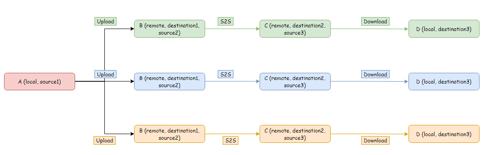

# Performance Testing Framework

The purpose of Performance Testing Framework is to test the performance of AzCopy operations.
It currently supports `azcopy copy` upload/S2S/download transfer. 

However, it can be easily integrated with other applications by modifying `run_azcopy.sh`.

## Getting started

 
### Step 1: Run the following command to get started
```bash
bash prerequisite.sh -n "$number_of_files" -e "$number_of_entities_per_level" -p "$path_location_A"
```

The script first downloads all the available AzCopy binaries 
```bash
bash download_azcopy_binaries.sh
```

Then, the script starts creating the location `A (source, local)` which will be common for all AzCopy upload operations.

### Step 2: Running Collator
```bash
bash collator.sh -p "$path_location_A" -s "$sas_validity_in_hrs" -o "copy/sync"
```
The framework uses SAS as a form of authentication. The SAS validity can be set by user depending upon the size of transfer.

Collator has an array of AzCopy version `versions=("10.5.1" "10.7.0")` which is used to define the versions we're trying to compare.
For every version in the `versions` array, collator performs following operations :

```bash
bash azcopy_copy_loop.sh -p "$path" -s "$sas_validity_in_hrs" -v "$version"
bash cleanup.sh -v "$version"
```

### Step 3 Understanding the output format
The output of each AzCopy operation will be redirected in a txt file: `performance_{upload/download/s2s}_{copy/sync}_{random_task_id}-{azcopy_version}.txt"`
